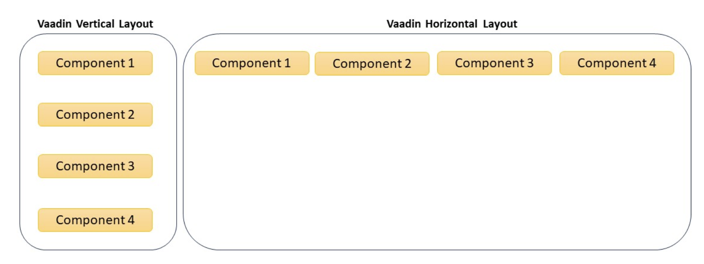
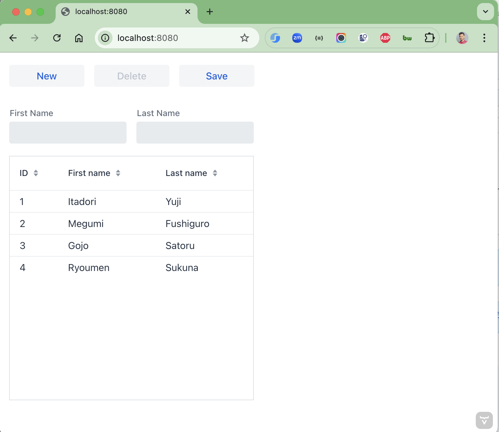
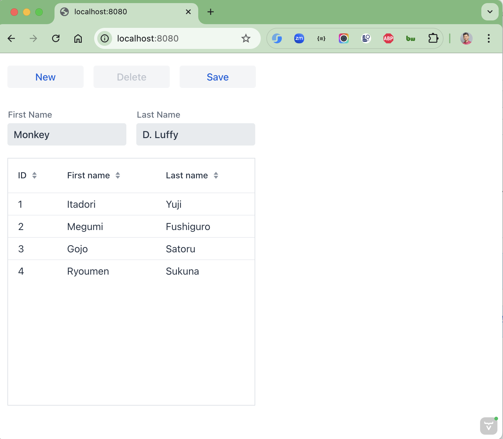
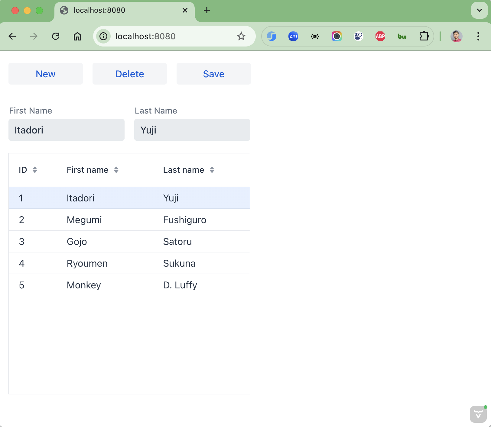

# spring-boot-vaadin-crud

Vaadin is a Java framework that simplifies front-end development by providing a rich set of reusable UI components and
layouts. In this Spring Boot and Vaadin tutorial, we will explore the process of developing a basic CRUD application.

### Basic Layouts

The Vaadin UI components are created inside a Layout. Layouts decide how components are positioned in the browser
window.

Vaadin provides several layout components and each has its own purpose and usage.

* AppLayout: includes a header, a sidebar or menu, and a content area where the main content of the application is
  displayed.
* VerticalLayout: displays components vertically in a top-down order or to stack components vertically.
* HorizontalLayout: displays components horizontally in a left-to-right order or to align components horizontally.
* GridLayout: divides the available space into a grid of cells for creating more complex grid-based layouts.
* FormLayout: organizes components in a single column with their captions for creating forms or vertical layouts with
  captions.
* SplitLayout: divides the available space into two or more resizable areas.
* Tabs: organizes components into separate tabs for creating multi-tab views.
  In this tutorial, we are using the VerticalLayout implementation.

### Things todo list

1. Clone this repository: `git clone https://github.com/hendisantika/spring-boot-vaadin-crud.git`
2. Navigate to the folder: `cd spring-boot-vaadin-crud`
3. Run the application: `mvn clean spring-boot:run`
4. Open your favorite browser: http://localhost:8080

### Image Screen shot

Add New Person

